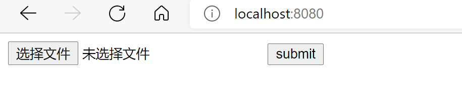

## Demo视频

https://www.bilibili.com/video/bv1df4y1b73T

## 实验环境选择

- 文件存储系统：[MinIO对象存储](https://min.io/)
- 消息队列：[RabbitMQ](https://www.rabbitmq.com/)
- 编码器：[JAVE2](https://github.com/a-schild/jave2)（基于FFmpeg）

## 基本流程介绍

1. 根目录下的upload、encode和download文件夹分别是视频上传、转码和下载服务的项目，均为Spring boot应用，可通过`mvn spring-boot:run`指令运行，或通过` mvn compile jib:dockerBuild`生成docker镜像。
2. upload应用会在`8080`端口的`/`路径接受文件，可以直接把视频文件用`POST`方法上传。为了方便演示，我们还实现了一个简易的HTML上传页面，在`/`路径提供服务。视频保存到MinIO后，upload应用会向RabbitMQ的`encode`队列发送一个格式为`timestamp filename`的消息。
3. encode应用在满足“正在编码的视频<2 and 队列中有未读消息”时，会从RabbitMQ的`encode`队列读取一个新消息，并启动一个新线程用于转码该视频。转码时，它先从MinIO读取原始视频，处理后再保存到MinIO上。其中，同时转码的最高视频数量可以在`application.properties`文件中修改。
4. download应用会在`8081`端口的`/`路径展示可播放的视频列表，点击某个视频的名称后会跳转到`/stream/[videoName]`路径的在线播放页面。在线播放时，可切换分辨率。`/video/[videoName]`还提供了对应视频的下载接口，可通过参数`resolution`指定分辨率（默认为原始视频）。


## 运行

1. 启动MinIO对象存储服务

   ```shell
   docker run -p 9000:9000 --name minio -e "MINIO_ACCESS_KEY=admin" -e "MINIO_SECRET_KEY=12345678" -v /mnt/minio/data:/data -v /mnt/minio/config:/root/.minio minio/minio server /data
   ```

   （请注意该命令会将相关数据挂载到/mnt/minio上）

2. 在MinIO的管理界面创建三个bucket，分别名为`video-original`，`video-360p`和`video-720p`。

3. 启动RabbitMQ服务

   ```shell
   docker run -it --rm --name rabbitmq -p 5672:5672 -p 15672:15672 rabbitmq:3-management
   ```

4. 分别修改三个子系统的`application.properties`文件，尤其是其中的IP地址、bucket名称等相关信息。

5. 分别在`upload`、`encode`和`download`目录下执行`mvn spring-boot:run`，`8080`端口、`8081`端口分别提供视频上传、下载服务。

## 压力测试

所有的原始数据均保存与`./load_testing_data`文件夹中，其中下划线后的数字表示同时开启的服务器数量。

### 视频上传服务拓展

我们使用docker同时开启多个上传服务，通过HAProxy进行负载均衡，再使用Gatling进行压力测试。每次测试的`atOnceUsers`为50。对于每种配置，我们一共进行了三次测试，数据如下：

- 使用1台服务器：平均响应时间分别为11570ms，13231ms和14563ms。均值为13121ms。
- 使用4台服务器：平均响应时间分别为8928ms，10539ms和13420ms。均值为10962ms。

**在使用了4台服务器后，平均响应时间相比1台服务器降低了16.5%，说明该系统是可拓展的**。同时，可以看到响应时间的降低比例与服务器数量的新增比例之间的差异（服务器数量提高了400%，响应时间只降低了16.5%），我们认为主要原因是上传服务的瓶颈是存储系统，而该实验并没有对存储系统进行扩展。

### 视频下载服务拓展

实验的基本流程和方法、使用的配置均与“视频上传服务拓展”完全一致。数据如下：

- 使用1台服务器：平均响应时间分别为14256ms，12387ms和11469ms。均值为12704ms。
- 使用4台服务器：平均响应时间分别为12808ms，10881ms和9932ms。均值为11207ms。

**在使用了4台服务器后，平均响应时间相比1台服务器降低了11.8%，说明该系统是可拓展的**。

### 视频转码服务拓展

我们使用docker同时开启多个转码服务，每个转码服务最多同时处理1个视频，然后使用Gatling一次性上传20个视频。我们主要关注“从消息进入队列到视频转码完成的总时长”这一指标（该指标既包含了消息在队列中的等待时间，也包含了该视频的转码时间 ）。数据如下：

- 实验1台服务器：平均时长为227003ms。
- 使用2台服务器：平均时长为85964ms。

**在使用了2台服务器后，平均时长相比1台服务器降低了62.1%，说明该系统是可拓展的。**

## 运行截图




